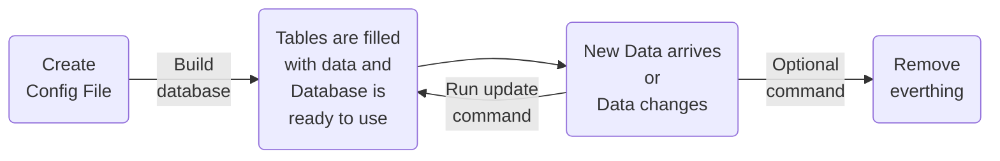

# About fits2db
Do you have a large number of daily generated FITS files that you need to manage within a complex folder structure? If so, this project might be exactly what you're looking for! The primary goal of `fits2db` is to provide a straightforward and efficient way to load the data contained in your FITS files into a structured SQL database, making it easier to manage, query, and analyze.

## Why should I use a database?
Managing a large collection of FITS files directly in a folder structure can become cumbersome and inefficient as the number of files grows. Here’s why using a database is a better approach:

- __Centralized Data Management:__ A database allows you to centralize your data, making it easier to access, search, and manage compared to navigating through a multitude of files spread across directories.

- __Efficient Querying:__ SQL databases are optimized for querying. You can quickly search, filter, and retrieve specific data from large datasets, which would be far more time-consuming if you were parsing through individual files manually.

- __Data Integrity and Consistency:__ Using a database ensures that your data remains consistent and avoids issues such as duplicate entries or data loss, which can happen when managing files individually.

- __Scalability:__ As your dataset grows, managing thousands or even millions of files in a folder structure can become impractical. Databases are designed to scale efficiently, allowing you to handle larger volumes of data without performance degradation.

- __Automation:__ With fits2db, you can automate the process of loading new data into your database, saving you time and reducing the likelihood of human error.

## Who Should Use fits2db?

`fits2db` is ideal for researchers, data scientists, and engineers who deal with large volumes of FITS files on a regular basis and need an efficient way to organize, manage, and query their data. This tool is particularly useful in fields like astronomy, where FITS files are commonly used to store observations and measurement data.

If you are looking to streamline your data management process, minimize manual file handling, and take advantage of the querying power of SQL, fits2db is a great fit for your workflow.

## Probably Not for You
On the other hand, if your needs are simple—such as opening a single FITS file occasionally to extract data `fits2db` might not be the right tool. In such cases, a lightweight FITS file viewer or a scripting approach with [`Astropy`](https://www.astropy.org/) to handle individual files may be more appropriate.

## How Does fits2db Work?
fits2db is designed to streamline the process of managing and updating large datasets stored in FITS files by integrating them into a SQL database. Here's a high-level overview of the workflow:

- __Configuration Setup:__ You start by creating a configuration file that outlines the data sources (the directories containing your FITS files) and the destination (your SQL database). This configuration serves as the blueprint for how fits2db interacts with your data.

- __Building the Database:__ Using the configuration file, fits2db initializes the database by creating tables that correspond to the data structures in your FITS files. It then populates these tables with the data, ensuring that everything is organized and ready for querying.

- __Updating the Database:__ As your data evolves—new FITS files are added, or existing ones are modified—fits2db allows you to update your database efficiently. It identifies changes and ensures that only new or updated data is uploaded, keeping your database synchronized with the latest information.

- __Metadata Management:__ Throughout the process, fits2db automatically maintains metadata tables that track the files, tables, and data within your database. This metadata is crucial for ensuring data integrity and facilitating easy management of your data over time.

- __Lifecycle Management:__ If needed, fits2db can also clean up the database by removing the entire table structure, giving you control over the full lifecycle of your data from creation to deletion.

### Lifecycle of fits2db

This high-level overview illustrates the simplicity and efficiency of managing FITS files with fits2db, from initial setup to ongoing updates, all while maintaining robust metadata management to keep your data organized and accessible.

## How the Meta tables are connected
The automatic created Metadata tables are to keep track of the files that are uploaded. This is done so that if you run update not everything gets rewritten but only the changed/new files get updated while the rest stays the same.

::: fits2db.adapters.meta

